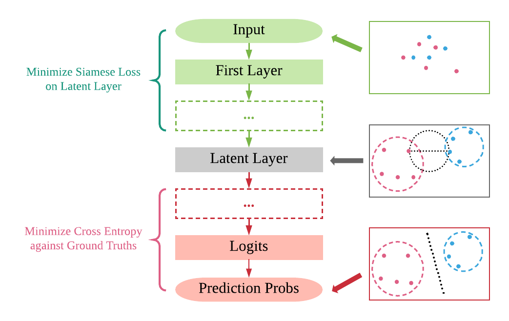

<!--  -->

# Partial Siamese Training - An Example With AlexNet

This project aims to partially employ another optimization technique rather than pure gradient based method.
The techinque is referred to as *Optimization Objective Breakdown*, as it breaks down optimization into two (or more) parts.

## How to Improve upon Gradient-Based Methods
### Illustration of the Proposed Method

### Gradient-Based Methods
Traditional methods of tuning a neural network relies heavily (and often solely) on gradients w.r.t. loss function $\nabla_{\theta}l(y, \hat{y})$, where the loss function $l(\cdot, \cdot)$ is typically a cross-entropy.
When the nerual net is too deep, overfitting and gradient vanishment becomes a major problem, especially if input samples are rare or different labels share a similar distribution.

### Optmization Object Breakdown
With *Optimization Objective Breakdown*, we improve upon the gradient model by splitting the network into two parts, separated by a *latent layer*.
We define a pair-wise loss function on representations in the *latent layer*--our choice is the Siamese Loss.
- All layers prior to the *latent layer* is trained with the objective of minimizing Siamese Loss on the *latent layer*.
- All layers pursuant to the *latent layer* is trained with the objective of minimizing cross-entropy on the *prediction layer*.
## Mathematical Intuition

This repository contains all the code needed to finetune [AlexNet](http://papers.nips.cc/paper/4824-imagenet-classification-with-deep-convolutional-neural-networks.pdf) on any arbitrary dataset. Beside the comments in the code itself, I also wrote an article which you can fine [here](https://kratzert.github.io/2017/02/24/finetuning-alexnet-with-tensorflow.html) with further explanation.

All you need are the pretrained weights, which you can find [here](http://www.cs.toronto.edu/~guerzhoy/tf_alexnet/) or convert yourself from the caffe library using [caffe-to-tensorflow](https://github.com/ethereon/caffe-tensorflow).
If you convert them on your own, take a look on the structure of the `.npy` weights file (dict of dicts or dict of lists).

**Note**: I won't write to much of an explanation here, as I already wrote a long article about the entire code on my blog.

## Requirements

- Python 3
- TensorFlow >= 1.12rc0
- Numpy


## TensorBoard support

The code has TensorFlows summaries implemented so that you can follow the training progress in TensorBoard. (--logdir in the config section of `finetune.py`)

## Content

- `alexnet.py`: Class with the graph definition of the AlexNet.
- `finetune.py`: Script to run the finetuning process.
- `datagenerator.py`: Contains a wrapper class for the new input pipeline.
- `caffe_classes.py`: List of the 1000 class names of ImageNet (copied from [here](http://www.cs.toronto.edu/~guerzhoy/tf_alexnet/)).
- `validate_alexnet_on_imagenet.ipynb`: Notebook to test the correct implementation of AlexNet and the pretrained weights on some images from the ImageNet database.
- `images/*`: contains three example images, needed for the notebook.

## Usage

All you need to touch is the `finetune.py`, although I strongly recommend to take a look at the entire code of this repository. In the `finetune.py` script you will find a section of configuration settings you have to adapt on your problem.
If you do not want to touch the code any further than necessary you have to provide two `.txt` files to the script (`train.txt` and `val.txt`). Each of them list the complete path to your train/val images together with the class number in the following structure.

```
Example train.txt:
/path/to/train/image1.png 0
/path/to/train/image2.png 1
/path/to/train/image3.png 2
/path/to/train/image4.png 0
.
.
```
were the first column is the path and the second the class label.

The other option is that you bring your own method of loading images and providing batches of images and labels, but then you have to adapt the code on a few lines.
